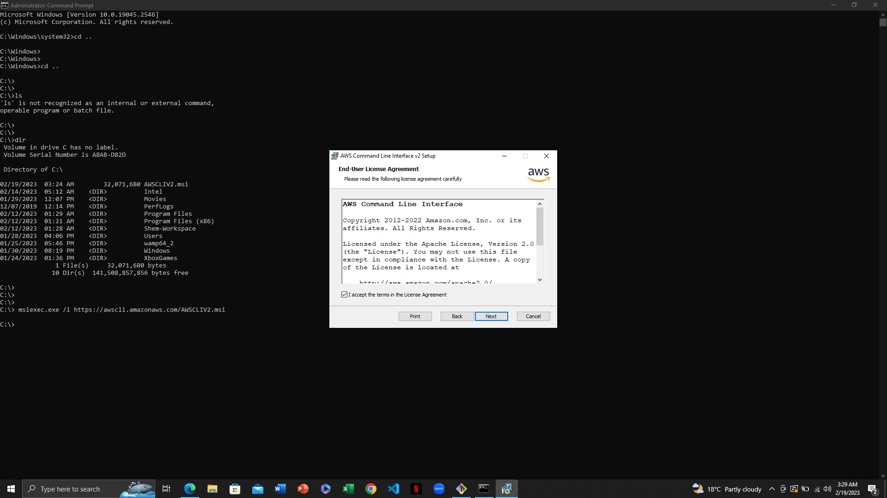
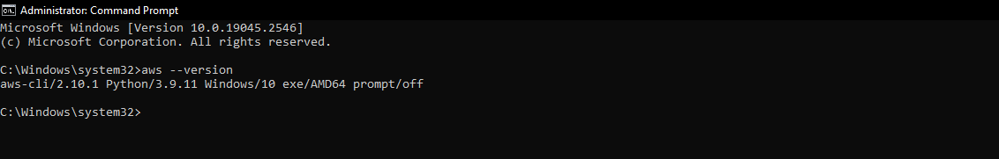
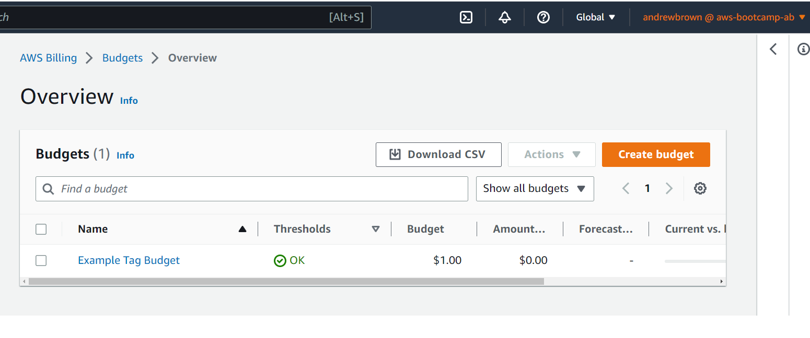
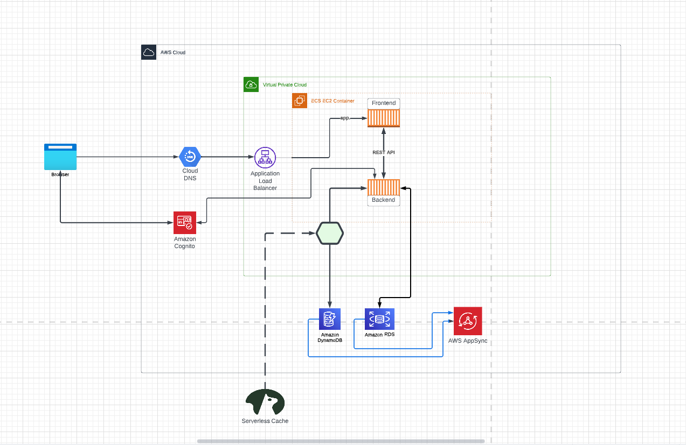

# Week 0 — Billing and Architecture

## Required Homework/Tasks

### Install and Verify AWS CLI 

Because of browser issues, I couldn't use Gitpod or Github Codespaces, so I opted for a local environment instead.

To demonstrate my ability to use the AWS CLI, I will share the steps I followed to configure it on my Windows machine.

These are the steps I took to install the AWS CLI.

I installed the AWS CLI for Windows 10 via command in **Command Prompt**:

I followed the instructions on the [AWS CLI Install Documentation Page](https://docs.aws.amazon.com/cli/latest/userguide/getting-started-install.html)



```
msiexec.exe /i https://awscli.amazonaws.com/AWSCLIV2.msi
```



### Create a Budget

I created my own Budget for $1 because I cannot afford any kind of spend.
I did not create a second Budget because I was concerned of budget spending going over the 2 budget free limit.

 

### Recreate Logical Architectural Deisgn



[Lucid Charts Share Link](https://lucid.app/lucidchart/67864c38-319a-425c-9c55-76dc8521e8b2/edit?viewport_loc=-472%2C-172%2C2431%2C1214%2C0_0&invitationId=inv_ca2275e6-d131-4d31-ae5a-91f548282a31
)
